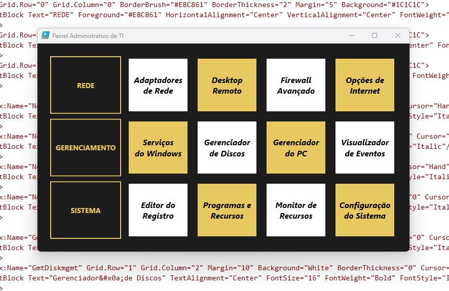

# Painel Administrativo de TI (PowerShell + WPF)

Uma interface gráfica (GUI) moderna, limpa e eficiente inspirada no estilo *Metro Tiles*, desenvolvida inteiramente em **PowerShell** utilizando **WPF (Windows Presentation Foundation)**. Este painel centraliza o acesso às principais ferramentas nativas de gerenciamento, rede e sistema do Windows, eliminando a necessidade de lembrar comandos complicados no `Executar` (Win + R).

## 📸 Demonstração

---

## 🚀 Recursos

- **Design Moderno:** Fundo escuro com blocos contrastantes em branco e dourado (`#E8C861`), oferecendo excelente legibilidade.
- **Categorização Clara:** Ferramentas organizadas logicamente em três linhas principais: **Rede**, **Gerenciamento** e **Sistema**.
- **Código Otimizado:** Utiliza uma função centralizada (`Abrir-Programa`) com tratamento de erros nativo (`try/catch`) para garantir estabilidade.
- **Responsivo e Leve:** Carregamento rápido sem necessidade de instalar dependências externas pesadas, usando apenas o .NET do próprio Windows.

---

## 🛠️ Ferramentas Incluídas

| Categoria | Ferramenta | Comando Nativo | Descrição |
| :--- | :--- | :--- | :--- |
| **REDE** | Adaptadores de Rede | `ncpa.cpl` | Gerenciamento de interfaces físicas e virtuais |
| | Desktop Remoto | `mstsc.exe` | Conexão RDP para suporte ou servidores |
| | Firewall Avançado | `wf.msc` | Configuração de regras de entrada/saída |
| | Opções de Internet | `inetcpl.cpl` | Configurações de proxy e certificados |
| **GERENCIAMENTO**| Serviços do Windows | `services.msc` | Iniciar, parar e configurar serviços de sistema |
| | Gerenciador de Discos| `diskmgmt.msc`| Particionamento e formatação de volumes |
| | Gerenciador do PC | `compmgmt.msc`| Console unificado de administração |
| | Visualizador de Eventos| `eventvwr.msc`| Logs de erro, aviso e auditoria |
| **SISTEMA** | Editor do Registro | `regedit.exe` | Modificações avançadas na colmeia do Windows |
| | Programas e Recursos| `appwiz.cpl` | Desinstalação rápida de softwares |
| | Monitor de Recursos | `resmon.exe` | Análise detalhada de CPU, RAM, Disco e Rede |
| | Configuração do Sistema| `msconfig.exe`| Controle de inicialização e serviços de boot |

---

## 📦 Como Executar

Como o script utiliza o WPF, você precisa executá-lo em um ambiente Windows através do PowerShell.

1. **Baixe o arquivo** do script (ex: `painel_administrativo_ti.ps1`).
2. Abra o PowerShell (recomenda-se como **Administrador** para que todas as ferramentas do painel funcionem sem restrições de privilégio).
3. Se necessário, libere a execução de scripts na sua sessão:
